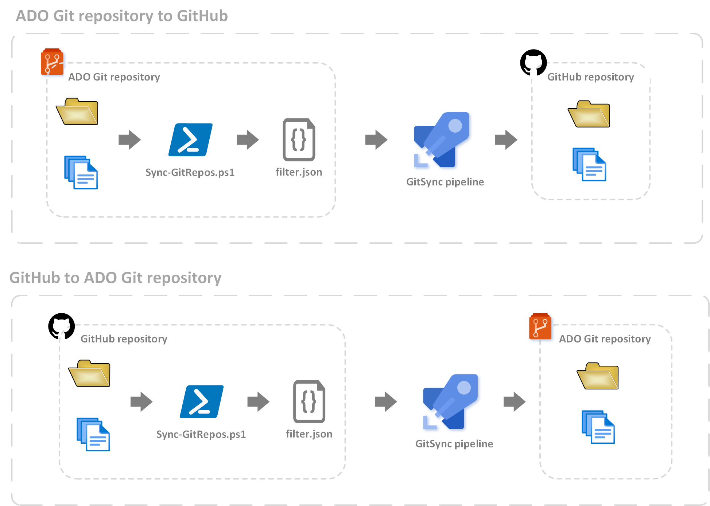

# GitSync Solution

[[_TOC_]]

---
---

## Overview
GitSync is a PowerShell and yaml based utility that synchronizes files between ADO Git and GitHub repositories. GitSync supports bi-directional synchronization and file filtering capabilities based on file extensions, individual files, and entire folders.



## Prerequisites

1. ADO Git Repository
2. GitHub Repository
3. GitHub [Personal access token](https://docs.github.com/en/free-pro-team@latest/github/authenticating-to-github/creating-a-personal-access-token "GitHub Personal Access Token") with repo scope
4. Azure DevOps [Personal access token](https://docs.microsoft.com/en-us/azure/devops/organizations/accounts/use-personal-access-tokens-to-authenticate?view=azure-devops&tabs=preview-page "ADO Personal Access Token") with Code scope

## Components

1. [Sync-GitRepos.ps1](../GitSync/Sync-GitRepos.ps1 "Sync-GitRepos.ps1") - PowerShell script that performs the synchronization between repositories
2. [pipeline.yml](../GitSync/pipeline.yml "pipeline.yml") - YAML pipeline file that executes the Sync-GitRepos.ps1 PowerShell script
3. [filter.json](../GitSync/filter.json "filter.json") - JSON file for filtering the files to be synchronized to the destination repository

## Assumptions

1. The primary or main branch in the destination repository is named "master".
2. The GitHub and ADO personal access tokens should allow for code pushes to the "master" branch of the destination repository.

## Implementation

Follow the steps below to implement the solution in your environment:

1. Copy the GitSync folder to the ADO Git repository to be synchronized.

2. Create a Pipeline Library named components.utilities.gitsync with the following variables:

    - ado.servicescode.iacs.adousername - user name for the user associated with the pat token on the ADO repo organization
    - ado.servicescode.iacs.filterfilepath - path to the filter file in the ADO Git repo
    - ado.servicescode.iacs.gitemail - global commit email address for the ADO Git repo commits
    - ado.servicescode.iacs.gitusername - global commit user name for the ADO Git repo commits
    - ado.servicescode.iacs.pat - personal access token for the ADO Git repo
    - ado.servicescode.iacs.url - URL of the ADO Git repo e.g. dev.azure.com/&lt;org name&gt;/&lt;repo name&gt;
  
    - ghe.mcs.iacs.filterfilepath - path to the filter file in the GitHub repo
    - ghe.mcs.iacs.gitemail - Global commit email address for the GitHub repo commits
    - ghe.mcs.iacs.gitusername - global commit user name for the repo commits
    - ghe.mcs.iacs.githubusername - user name for the user associated with the pat token on the GitHub repo organization
    - ghe.mcs.iacs.pat - personal access token for the GitHub repo
    - ghe.mcs.iacs.url - URL of the GitHub repo e.g. github.com/&lt;org name&gt;/&lt;repo name&gt;

3. Create a new pipeline from the pipeline.yml file.

4. Edit the [filter.json](../GitSync/filter.json "filter.json") file per your filter requirements. Refer to the Filter Guide below for examples of how to filter files.
   
## Filter guide

GitSync uses the filter.json file to potentially exclude certain files from synchronizing to the destination repository. Files can be excluded based on file extensions, individual files, or folders.

### Filter by file extensions

To filter by file extensions, add the file extensions inside the Extensions array. Each entry should be enclosed in quotation marks, start with an asterisk wildcard, and multiple extensions should be comma delimited as shown in the example below:

```json
{
    "Extensions":[
        "*.yml",
        "*.md"
    ]
}
```

### Filter by Files

To filter by individual files, add the file names and paths inside the Files array. File names are relative to the root directory. Each entry should be enclosed in quotation marks and multiple entries should be comma delimited. See the examples below:

```json
{
    "Files":[
        "*/pipeline.yml", // File that exists at the root directory
        "*pipeline.yml" // Any pipeline.yml file within the repo hierarchy
        "*/Modules/TF/ActionGroup/pipeline.yml" // Partial file path preceded by wildcard 
    ]
}
```

### Filter by Folders

To filter by entire directories, add the folder names and paths inside the Folders array. Folder names are relative to the root directory. Each entry should be enclosed in quotation marks and multiple entries should be comma delimited. See the examples below:

```json
{
    "Folders":[
        "*/ActionGroup/*", // Any folder named ActionGroup and its child resources
        "*/Module/TF/ActionGroup/*" // Explicit folder path and child resources
        "*/Module" // Explicit root folder and child resources

    ]
}
```

5. Run the pipeline manually or the pipeline can be triggered by a pull request on the master branch.