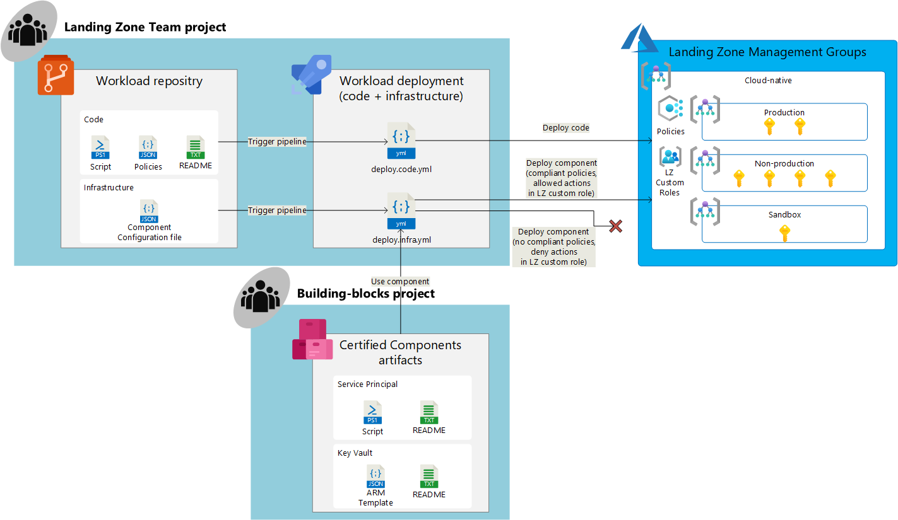

[[_TOC_]]

# Overview

> NOTE: the diagram can be modified using the Visio file on [Teams GRP MCS Cloud-native Engagement > Agile Delivery](https://teams.microsoft.com/_?lm=deeplink&lmsrc=homePageWeb&cmpid=WebSignIn#/conversations/Agile%20Delivery?threadId=19:2e84079377e541aaae5663305c890086@thread.tacv2&ctx=channel) > Files > [01 - Design Documents](https://contoso.sharepoint.com/sites/GRP_001608-AgileDelivery/Shared%20Documents/Forms/AllItems.aspx?RootFolder=%2Fsites%2FGRP%5F001608%2DAgileDelivery%2FShared%20Documents%2FAgile%20Delivery%2F01%20%2D%20Design%20Documents&FolderCTID=0x01200001544C4EB547E84DB41D1C6FCCD4BEA9) > [PXS - Diagrams.vsdx](https://teams.microsoft.com/l/file/6F59E176-935C-450C-B8A0-A23AB3831B4C?tenantId=e7ab81b2-1e84-4bf7-9dcb-b6fec01ed138&fileType=vsdx&objectUrl=https%3A%2F%2Fcontoso.sharepoint.com%2Fsites%2FGRP_001608-AgileDelivery%2FShared%20Documents%2FAgile%20Delivery%2F01%20-%20Design%20Documents%2FPXS%20-%20Diagrams.vsdx&baseUrl=https%3A%2F%2Fcontoso.sharepoint.com%2Fsites%2FGRP_001608-AgileDelivery&serviceName=teams&threadId=19:2e84079377e541aaae5663305c890086@thread.tacv2&groupId=348f9039-5718-417a-8e56-85e2957e26be)

# What is a Certified Component?

> See section [IaC Module](/Learning-resources/Infrastructure-as-Code/IaC-Modules.md) to learn about modularization principles

A Certified Component consisting of a small, reusable piece of code (normally an idempotent script or an Azure Resource Manager template) following [Infrastructure as Code principles](/Learning-resources/Infrastructure-as-Code.md) and in compliance with the [Cloud-Native Security controls](/Cloud-Native-Security-Controls.md) that can be used as part of an Azure DevOps Pipeline to deploy and manage [Azure infrastructure](https://azure.microsoft.com/en-us/services/) using declarative syntax.

Certified Components are designed to fit the requirements of specific Workload(s) or Use Cases and they result from the [Certification Process](Certification-Process.md) of each required Azure Product. Each Certified Component contains:
- **Idempotent Script or ARM template**. Each component will have a reusable idempotent pre-approved script or ARM template that can be used in an Azure DevOps Pipeline.
- **Design documentation**. Each component will have an entry in the [Product Catalog](/Product-Catalog.md) with information related to the Azure Service that has been certified and all the agreements reached as part of the [certification process](/Certification-Process.md), including agreements about how to implement the [Cloud-Native security controls](/Cloud-Native-Security-Controls.md).
- **Implementation details**. Each component will have a README.md file that includes details about decisions taken during the implementation of the component and guidelines for using the component in an Azure DevOps pipeline.
- **Azure Policies**. Each component will have a set of Azure Policies that take effect in all the [Cloud-Native Landing Zones](/Foundation-Design/Cloud%2DNative-Landing-Zone.md) and guarantee or enforce that the Azure Products are always configured as expected according.

# Who can deploy a Certified Component?

Certified Components are designed to be used in the context of [Cloud-native Landing Zones](/Foundation-Design/Cloud%2DNative-Landing-Zone.md). That means, Landing Zone Teams are the main users of Certified Components. Landing Zone Teams are Platform Teams that will re-use Certified Components to deploy and manage the platform they own in Azure.

- Certified Components will be designed based on the needs of Landing Zone Teams. They must be usable for the identified use cases.
- Landing Zone Teams can use the scripts and ARM Templates that the CCoE team publishes for each Certified Components. This templates and script have been configured to meet [Cloud-Native Security controls](/Cloud-Native-Security-Controls.md) so that the Landing Zone Teams don't need to duplicate effort. The documentation of each Component will explain what controls are met and how these controls have been implemented.

# Limitations of Certified Components in Cloud-native environments

Landing Zone Teams have the option to not use the scripts and templates published for each Certified Component. This flexibility is intentional to allow teams responsible for cloud-native workloads to use . However, with the Certified Components approach, we aim to guarantee certain level of compliance for the certified Azure Services so that we can achieve a good **balance between autonomy and control**. We will achieve this balance through controls at different planes:

1. We set [limitations in the Azure DevOps Projects](#limitations-in-the-azure-devops-projects)
2. We set [limitations in RBAC for Landing Zone Service Principals](#limitations-in-rbac-for-landing-zone-service-principals)
3. We set [limitations for Azure deployments in Cloud-native environments via Azure Policies](#limitations-for-azure-deployments-in-cloud-native-environments-via-azure-policies)

> NOTE: the diagram can be modified using the Visio file on [Teams GRP MCS Cloud-native Engagement > Agile Delivery](https://teams.microsoft.com/_?lm=deeplink&lmsrc=homePageWeb&cmpid=WebSignIn#/conversations/Agile%20Delivery?threadId=19:2e84079377e541aaae5663305c890086@thread.tacv2&ctx=channel) > Files > [01 - Design Documents](https://contoso.sharepoint.com/sites/GRP_001608-AgileDelivery/Shared%20Documents/Forms/AllItems.aspx?RootFolder=%2Fsites%2FGRP%5F001608%2DAgileDelivery%2FShared%20Documents%2FAgile%20Delivery%2F01%20%2D%20Design%20Documents&FolderCTID=0x01200001544C4EB547E84DB41D1C6FCCD4BEA9) > [PXS - Diagrams.vsdx](https://teams.microsoft.com/l/file/6F59E176-935C-450C-B8A0-A23AB3831B4C?tenantId=e7ab81b2-1e84-4bf7-9dcb-b6fec01ed138&fileType=vsdx&objectUrl=https%3A%2F%2Fcontoso.sharepoint.com%2Fsites%2FGRP_001608-AgileDelivery%2FShared%20Documents%2FAgile%20Delivery%2F01%20-%20Design%20Documents%2FPXS%20-%20Diagrams.vsdx&baseUrl=https%3A%2F%2Fcontoso.sharepoint.com%2Fsites%2FGRP_001608-AgileDelivery&serviceName=teams&threadId=19:2e84079377e541aaae5663305c890086@thread.tacv2&groupId=348f9039-5718-417a-8e56-85e2957e26be)

## Limitations in the Azure DevOps Projects

> The Azure DevOps Projects provisioned as part of the Cloud-Native Landing Zones are described in section [Foundation Design](/Foundation-Design/Azure-DevOps-Organization/Building%2Dblocks-Project.md) > [Azure DevOps Organization](/Foundation-Design/Azure-DevOps-Organization.md) > [Landing Zone Team Project](/Foundation-Design/Azure-DevOps-Organization/Landing-Zone-Team-Project.md)

> NOTE: the diagram can be modified using the Visio file on [Teams GRP MCS Cloud-native Engagement > Agile Delivery](https://teams.microsoft.com/_?lm=deeplink&lmsrc=homePageWeb&cmpid=WebSignIn#/conversations/Agile%20Delivery?threadId=19:2e84079377e541aaae5663305c890086@thread.tacv2&ctx=channel) > Files > [01 - Design Documents](https://contoso.sharepoint.com/sites/GRP_001608-AgileDelivery/Shared%20Documents/Forms/AllItems.aspx?RootFolder=%2Fsites%2FGRP%5F001608%2DAgileDelivery%2FShared%20Documents%2FAgile%20Delivery%2F01%20%2D%20Design%20Documents&FolderCTID=0x01200001544C4EB547E84DB41D1C6FCCD4BEA9) > [PXS - Diagrams.vsdx](https://teams.microsoft.com/l/file/6F59E176-935C-450C-B8A0-A23AB3831B4C?tenantId=e7ab81b2-1e84-4bf7-9dcb-b6fec01ed138&fileType=vsdx&objectUrl=https%3A%2F%2Fcontoso.sharepoint.com%2Fsites%2FGRP_001608-AgileDelivery%2FShared%20Documents%2FAgile%20Delivery%2F01%20-%20Design%20Documents%2FPXS%20-%20Diagrams.vsdx&baseUrl=https%3A%2F%2Fcontoso.sharepoint.com%2Fsites%2FGRP_001608-AgileDelivery&serviceName=teams&threadId=19:2e84079377e541aaae5663305c890086@thread.tacv2&groupId=348f9039-5718-417a-8e56-85e2957e26be)

1. The Service Connections of the Landing Zone Team Azure DevOps projects are configured with the following permissions (See [Secure a service connection](https://docs.microsoft.com/en-us/azure/devops/pipelines/library/service-endpoints?view=azure-devops&tabs=yaml#secure-a-service-connection)):
   - **`LZ Team Contr` will only have `Use` permissions on these service connections**. Members of this Group can configure this Service Connections in their pipelines and have access to the subscriptions in Azure where these service principals have permissions.
   - **`LZ Team Readers` will not have any permissions on these service connections**.
   - **`LZ Team Admins` will have `Administration` permissions on these service connections**. Members of this team can only access Azure DevOps using their administrator accounts. 

## Limitations in RBAC for Landing Zone Service Principals

> The RBAC configured for each Service Principal in Cloud-Native Landing Zones is described in section [Foundation Design](/Foundation-Design.md) > [Cloud-Native Landing Zone](/Foundation-Design/Cloud%2DNative-Landing-Zone.md). The RBAC custom roles used to limit resource provider operations are described in section [Foundation Design](/Foundation-Design/Governance.md) > [Governance](/Foundation-Design/Governance.md)

> NOTE: the diagram can be modified using the Visio file on [Teams GRP MCS Cloud-native Engagement > Agile Delivery](https://teams.microsoft.com/_?lm=deeplink&lmsrc=homePageWeb&cmpid=WebSignIn#/conversations/Agile%20Delivery?threadId=19:2e84079377e541aaae5663305c890086@thread.tacv2&ctx=channel) > Files > [01 - Design Documents](https://contoso.sharepoint.com/sites/GRP_001608-AgileDelivery/Shared%20Documents/Forms/AllItems.aspx?RootFolder=%2Fsites%2FGRP%5F001608%2DAgileDelivery%2FShared%20Documents%2FAgile%20Delivery%2F01%20%2D%20Design%20Documents&FolderCTID=0x01200001544C4EB547E84DB41D1C6FCCD4BEA9) > [PXS - Diagrams.vsdx](https://teams.microsoft.com/l/file/6F59E176-935C-450C-B8A0-A23AB3831B4C?tenantId=e7ab81b2-1e84-4bf7-9dcb-b6fec01ed138&fileType=vsdx&objectUrl=https%3A%2F%2Fcontoso.sharepoint.com%2Fsites%2FGRP_001608-AgileDelivery%2FShared%20Documents%2FAgile%20Delivery%2F01%20-%20Design%20Documents%2FPXS%20-%20Diagrams.vsdx&baseUrl=https%3A%2F%2Fcontoso.sharepoint.com%2Fsites%2FGRP_001608-AgileDelivery&serviceName=teams&threadId=19:2e84079377e541aaae5663305c890086@thread.tacv2&groupId=348f9039-5718-417a-8e56-85e2957e26be)

1. Landing Zone Service Principals will be assigned with the custom role [`LZ Owner` at subscription level](/Foundation-Design/Governance.md#landing-zone-owner). This isolates permissions at subscription level, so that Service Principals can only do Azure Deployments in the Subscription they own.
2. Landing Zone Service Principals will have limited [azure resource provider operations](https://docs.microsoft.com/en-us/azure/role-based-access-control/resource-provider-operations) allowed in the LZ Owner custom role. **If the Landing Zone Team uses the Service Connection for a denied azure resource provider operation, [the deployment will be blocked](https://docs.microsoft.com/en-us/azure/role-based-access-control/overview#how-azure-rbac-works)**.

## Limitations for Azure deployments in Cloud-native environments via Azure Policies

> The strategy for Azure Policies in Cloud-native environments is described in section [Foundation Design](/Foundation-Design/Governance.md) > [Governance](/Foundation-Design/Governance.md#azure-policies)

> NOTE: the diagram can be modified using the Visio file on Teams GRP MCS Cloud-native Engagement > Agile Delivery > Files > [01 - Design Documents](https://contoso.sharepoint.com/sites/GRP_001608-AgileDelivery/Shared%20Documents/Forms/AllItems.aspx?RootFolder=%2Fsites%2FGRP%5F001608%2DAgileDelivery%2FShared%20Documents%2FAgile%20Delivery%2F01%20%2D%20Design%20Documents&FolderCTID=0x01200001544C4EB547E84DB41D1C6FCCD4BEA9) > [PXS - Diagrams.vsdx](https://teams.microsoft.com/l/file/6F59E176-935C-450C-B8A0-A23AB3831B4C?tenantId=e7ab81b2-1e84-4bf7-9dcb-b6fec01ed138&fileType=vsdx&objectUrl=https%3A%2F%2Fcontoso.sharepoint.com%2Fsites%2FGRP_001608-AgileDelivery%2FShared%20Documents%2FAgile%20Delivery%2F01%20-%20Design%20Documents%2FPXS%20-%20Diagrams.vsdx&baseUrl=https%3A%2F%2Fcontoso.sharepoint.com%2Fsites%2FGRP_001608-AgileDelivery&serviceName=teams&threadId=19:2e84079377e541aaae5663305c890086@thread.tacv2&groupId=348f9039-5718-417a-8e56-85e2957e26be))

In our Foundation Design, we are going to have two types of policies:
1. **Platform-level policies**. These policies affect to any resource type in Azure and are managed via infrastructure as code in the `Platform` repository. E.g. a Policy that limits the allowed Azure Region for any deployment, or a Policy that enables Security Center for any subscription.
   - See platform-level policies in section [Foundation Design > Governance](/Foundation-Design/Governance.md#configuration-details)
2. **Component-specific policies**. These policies affect only to the Azure Services analyzed for each Certified Component during the [Certification Process](/Certification-Process.md). They will be published via infrastructure as code in the `IaC` repository. E.g. policies that limit specific configurations of Key Vault (purge enabled) are key-valut specific policies and will follow the same lifecycle and versioning than the Key Vault Component. See [Component-versioning](/Certified-Components/Component-versioning.md)
   - See the [Product Catalog](/Product-Catalog.md) document of each Component to find out component-specific policies for each component

Policies can be deployed at different levels (Management Groups, Subscription, Resource Group, resource). The Management Group hierarchy defined for the foundation platform allows to deploy policies at Management Group levels and affect to all child resources in the hierarchy:
1. The Cloud-Native Environment inherits policies from root-level management group. At this Management Group, a Policy white lists the Azure Resources allowed, which becomes the first level of control.
2. The Cloud-Native Environment counts on some Azure Policies at Management Group Levels that will affect any deployment in the child subscriptions. These policies are designed to meet [Cloud-Native Security Controls](/Cloud-Native-Security-Controls.md) that affect to all resource types. **If the Landing Zone team uses the Service Connection for a operation that is not compliant with the policies, the deployment [might be blocked](https://docs.microsoft.com/en-us/azure/governance/policy/concepts/effects).**
3. Each Certified Component will have some Azure Policies specific for each [resource type](https://docs.microsoft.com/en-us/azure/azure-resource-manager/management/resource-providers-and-types) that will control specific configurations of each resource type. These Policies will be agreed as a result of the [Certification Process](Certification-Process.md) and will be published at Management Group Level so they affect to all subscriptions. **If the Landing Zone team uses the Service Connection for a operation that is not compliant with the policies, the deployment [might be blocked](https://docs.microsoft.com/en-us/azure/governance/policy/concepts/effects).**

# Design, development and publishing of Certified Components

> NOTE: the diagram can be modified using the Visio file on [Teams GRP MCS Cloud-native Engagement > Agile Delivery](https://teams.microsoft.com/_?lm=deeplink&lmsrc=homePageWeb&cmpid=WebSignIn#/conversations/Agile%20Delivery?threadId=19:2e84079377e541aaae5663305c890086@thread.tacv2&ctx=channel) > Files > [01 - Design Documents](https://contoso.sharepoint.com/sites/GRP_001608-AgileDelivery/Shared%20Documents/Forms/AllItems.aspx?RootFolder=%2Fsites%2FGRP%5F001608%2DAgileDelivery%2FShared%20Documents%2FAgile%20Delivery%2F01%20%2D%20Design%20Documents&FolderCTID=0x01200001544C4EB547E84DB41D1C6FCCD4BEA9) > [PXS - Diagrams.vsdx](https://teams.microsoft.com/l/file/6F59E176-935C-450C-B8A0-A23AB3831B4C?tenantId=e7ab81b2-1e84-4bf7-9dcb-b6fec01ed138&fileType=vsdx&objectUrl=https%3A%2F%2Fcontoso.sharepoint.com%2Fsites%2FGRP_001608-AgileDelivery%2FShared%20Documents%2FAgile%20Delivery%2F01%20-%20Design%20Documents%2FPXS%20-%20Diagrams.vsdx&baseUrl=https%3A%2F%2Fcontoso.sharepoint.com%2Fsites%2FGRP_001608-AgileDelivery&serviceName=teams&threadId=19:2e84079377e541aaae5663305c890086@thread.tacv2&groupId=348f9039-5718-417a-8e56-85e2957e26be)

See more details about this process in section [Component development process](/Certified-Components/Component-development-process.md).

# Usage of Certified Components by other teams in the organization

> NOTE: the diagram can be modified using the Visio file on [Teams GRP MCS Cloud-native Engagement > Agile Delivery](https://teams.microsoft.com/_?lm=deeplink&lmsrc=homePageWeb&cmpid=WebSignIn#/conversations/Agile%20Delivery?threadId=19:2e84079377e541aaae5663305c890086@thread.tacv2&ctx=channel) > Files > [01 - Design Documents](https://contoso.sharepoint.com/sites/GRP_001608-AgileDelivery/Shared%20Documents/Forms/AllItems.aspx?RootFolder=%2Fsites%2FGRP%5F001608%2DAgileDelivery%2FShared%20Documents%2FAgile%20Delivery%2F01%20%2D%20Design%20Documents&FolderCTID=0x01200001544C4EB547E84DB41D1C6FCCD4BEA9) > [PXS - Diagrams.vsdx](https://teams.microsoft.com/l/file/6F59E176-935C-450C-B8A0-A23AB3831B4C?tenantId=e7ab81b2-1e84-4bf7-9dcb-b6fec01ed138&fileType=vsdx&objectUrl=https%3A%2F%2Fcontoso.sharepoint.com%2Fsites%2FGRP_001608-AgileDelivery%2FShared%20Documents%2FAgile%20Delivery%2F01%20-%20Design%20Documents%2FPXS%20-%20Diagrams.vsdx&baseUrl=https%3A%2F%2Fcontoso.sharepoint.com%2Fsites%2FGRP_001608-AgileDelivery&serviceName=teams&threadId=19:2e84079377e541aaae5663305c890086@thread.tacv2&groupId=348f9039-5718-417a-8e56-85e2957e26be)

See more details about this process in section [Component deployment](/Certified-Components/Component-deployment.md).