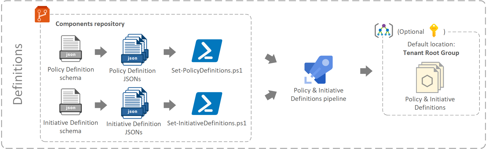
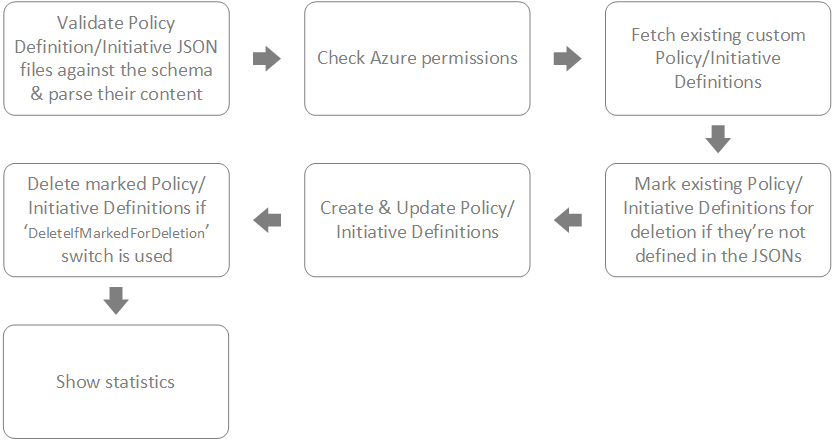

[[_TOC_]]

# Policy and Initiative Definitions

This chapter describes how Policy and Initiative Definitions are handled by the Policy-as-Code framework. To learn about how these definitions are used, see the [Assignments](./Assignments.md) section.

> **NOTE**: in a real customer environment, the Policy definitions should be onboarded to the `Policies` folder of the Components repository, so a the same team can create, test and manage policy and initiative definitions who is also responsible for other means of components (resource modules). Here however, for simplicity, we store both the Policy/Initiative definitions and assignments in the same `Utilities/PolicyAsCodeFramework` folder.
>
> **The below description refers to an ideal customer setup!** To find the files, referenced in this document, simply replace `Policies/xyz` with `Utilities/PolicyAsCodeFramework/Definitions/xyz`!

The components required for **creating / updating / deleting Policy definitions** are the followings:

| Component | What is it used for? | Where can it be found? |
|--|--|--|
| **Policy Definition JSON files** | Policy definitions files define what a custom Policy is able to do, what its name is, and more. | In any subfolders below the `Components/Policies/PolicyDefinitions` folder. |
| **Initiative Definition JSON files** | Initiative definitions files define what a custom Initiative is able to do, what its name is, and more. | In any subfolders below the `Components/Policies/InitiativesDefinitions` folder. |
| **Policy Definition Schema** | This schema defines the structure of the policy definitions files. These are tested against the schema when the configuration script is run. | In the `policyDefinitionSchema.json` inside the `Components/Policies` folder |
| **Initiative Definition  Schema** | This schema defines the structure of the initiative definitions files. These are tested against the schema when the configuration script is run. | In the `initiativeDefinitionSchema.json` inside the `Components/Policies` folder |
| **Policy Definition configuration script** | This script is used for creating / updating / deleting Policy definitions in Azure. These definitions are registered in the chosen scope (by default in the Tenant Root Group). | It's the `Components/Policies/Set-PolicyDefinitions.ps1` PowerShell script. |
| **Initiative Definition configuration script** | This script is used for creating / updating / deleting Initiative definitions in Azure. These definitions are registered in the chosen scope (by default in the Tenant Root Group). | It's the `Components/Policies/Set-InitiativeDefinitions.ps1` PowerShell script. |
| **Definitions Pipeline** | This pipeline invokes the configuration script that registers custom policy and initiative definitions in the scope provided. It is set to be triggered on any changes of the Policies folder in the Components repository. | The pipeline is defined in the `Components/Policies/pipeline.yml` file and registered in the `Components/Policies` Azure DevOps pipelines folder. |

All the above components reside in the `Components` repository.

> **NOTE**:
> When authoring policy/initiative definitions, check out the [Maximum count of Azure Policy objects](https://docs.microsoft.com/en-us/azure/governance/policy/overview#maximum-count-of-azure-policy-objects)

## Policy Definition JSON files and Schema

The Policy and Initiative definition files are structured based on the official [Azure Policy definition structure](https://docs.microsoft.com/en-us/azure/governance/policy/concepts/definition-structure) published by Microsoft. There are numerous definition samples available on Microsoft's [GitHub repository for azure-policy](https://github.com/Azure/azure-policy).

The schema implemented in the solution has been defined based on sample Policy and Initiative definitions, using the [JSONschema.net](https://www.jsonschema.net/home) online tool.

As long as all definition JSON files are compliant with the schema, the script should be able to register all Azure Policy and Initiative definitions based on these files.

The names of the definition JSON files don't matter, the Policy and Initiative definitions are registered based on the `name` attribute defined in the JSON's `properties`.

## Policy and Initiative definition configuration scripts

The `Set-PolicyDefinitions.ps1` script configures Azure Policy definitions and the `Set-InitiativeDefinitions.ps1` script is used to configure Initiatives.

Both scripts are **declarative** and **idempotent**: this means, that regardless how many times they are run, they always push all changes that were implemented in the JSON files to the Azure environment, i.e. if a JSON file is newly created/updated/deleted, the pipeline will create/update/delete the Policy and/or Initiative definition in Azure. If there are no changes, the pipeline can be run any number of times, as it won't make any changes to Azure.

With other words, **the code** (Policy and Initiative definition JSON files within the `Components` repository) **is the 'single source of truth'** for Policy and Initiative Definitions.

See the logical flow of the scripts below (both scripts follow the same structure):

> **NOTE**:
>
> More detailed description and examples for running the scripts can be found as comment based help in the scripts themselves. This can be accessed by opening the scripts in a text editor, or running the `Get-Help ./Set-PolicyDefinitions.ps1 -Full` and the `Get-Help ./Set-InitiativeDefinitions.ps1 -Full` command.
>
> Deletion of a definition is not possible if the policy or initiative is assigned to any Management Groups / Subscriptions / Resource groups.

## Definitions pipeline

This Policy/Initiative Definition pipeline runs two tasks:

- it invokes the Policy definitions configuration script (`Set-PolicyDefinitions.ps1`) with the below parameters.
- it invokes the Initiative definitions configuration script (`Set-InitiativeDefinitions.ps1`) with the below parameters.

The pipeline runs on behalf of a Service Principal that has **Owner** permissions on the Tenant Root Group level. This is required as the policy assignments pipeline is running under the same SPN, and for DeployIfNotExists and Modify policies it has to be able to configure RBAC assignments on the scope the policy is assigned to (to allow the MSI to interact with Azure).

> **NOTE**: Alternatively, the _Resource Policy Contributor_ role could also be used for the definitions pipeline if wasn't sharing the same SPN with the assignments pipeline.

### Policy definition task parameters

| Parameter | Value| Explanation |
|--|--|--|
| `ManagementGroupName` | 123456789-1234-1234-1234-123456789012 | The policy definitions are registered to the Tenant Root Group. |
| `PolicyDefinitionRootFolder` | $(Build.Repository.LocalPath)/Policies/PolicyDefinitions| All the policy definitions can be found in any subfolders of this root directory. |
| `PolicyDefinitionSchemaFilePath` | $(Build.Repository.LocalPath)/Policies/policyDefinitionSchema.json | The policy definition JSON schema's file path. |
| `DeleteIfMarkedForDeletion` | <isPresent> | This makes sure that all those policy definitions are deleted that are not defined in any of the JSON files. |

### Initiative definition task parameters

| Parameter | Value| Explanation |
|--|--|--|
| `ManagementGroupName` | 123456789-1234-1234-1234-123456789012 | The initiative definitions are registered to the Tenant Root Group. |
| `InitiativeDefinitionRootFolder` | $(Build.Repository.LocalPath)/Policies/InitiativeDefinitions | All the initiative definitions can be found in any subfolders of this root directory. |
| `InitiativeDefinitionSchemaFilePath` | $(Build.Repository.LocalPath)/Policies/initiativeDefinitionSchema.json | The initiative definition JSON schema's file path. |
| `DeleteIfMarkedForDeletion` | <isPresent> | This makes sure that all those initiative definitions are deleted that are not defined in any of the JSON files. |

## Tested scenarios / Error handling

### Policy definition tests

| # | Test scenario | Outcome |
|--|--|--|
|1.| No JSON files in Definitions folder | Error thrown, as expected. |
|2.| Invalid JSON file ('{' removed from the first line) | Error thrown, as expected. |
|3.| JSON file is not compliant with the schema (name removed) | Error thrown, as expected. |
|4.| Creation of two new definitions | Definitions registered successfully. |
|5.| Updated the description field of one definition | Definition updated successfully. |
|6.| Delete one of the definitions | Definition deleted successfully. |
|7.| Change 'name' attribute within the definition | Results the deletion of existing, creation of new definition as expected. |
|8.| Multiple JSON files containing the same definition name | Error thrown, as expected. The user will have to manually resolve the conflict. |
| 9. | Deleting a definition that is assigned. | Error thrown, as expected. All assignments have to be removed first. |
| 10. | Add additional parameter for an already assigned policy definition without default value |Error thrown, as expected|
| 11. |Add additional parameter for an already assigned policy definition with default value |Definition updated successfully|
| 12. | Delete parameter for an already assigned policy definition |Error thrown, as expected|
| 13. | Updating existing parameters in the definition that is assigned. | Definition updated successfully|

### Initiative definitions tests

| # | Test scenario | Outcome |
|--|--|--|
| 1.|No JSON files in Initiatives folder | Error thrown, as expected. |
| 2.|Invalid JSON file ('{' removed from the first line) | Error thrown, as expected.|
| 3.|JSON file is not compliant with the schema (name removed) | Error thrown, as expected.|
| 4.|Creation of two new initiatives | Initiatives registered successfully.|
| 5.|Updated the description field of one initiative | Initiative updated successfully.|
| 6.|Delete one initiative | Initiative deleted successfully.|
| 7.|Change Initiative category | Initiative updated successfully.|
| 8.|Change 'name' attribute within the initiative | Results the deletion of existing, creation of new initiative as expected.|
| 9.|Multiple JSON files containing the same initiative name | Error thrown, as expected. The user will have to manually resolve the conflict.|
| 10.|Add additional initiative parameter for an existing initiative without default value | Error thrown, as expected.|
| 11.|Add additional initiative parameter for an existing initiative with default value | Initiative updated successfully.|
| 12.|Remove an initiative parameter for an existing initiative | Error thrown, as expected.|
| 13.|Reference a not defined policyDefinitionID (at that scope) in the initiative | Error thrown, as expected.|
| 14.|Reference an parameter in a policyDefinition, that is not defined in the policyDefinition | Error thrown, as expected.|
| 15.|Define a parameter at the initiative, that is not used in any policyDefinition parameters | Error thrown, as expected.|
| 16.|Don't use a parameter from an existing initiative definition anymore in any policyDefinition parameters | Initiative updated successfully.|
| 17.|Use undefined parameter in any of the referenced policyDefinitions | Error thrown, as expected.|
| 18.|Use wrong parameter type (str,int,bool,array,obj) or invalid value in direct assignment to a policyDefinition parameter | Error thrown, as expected.|
| 19.|Specify only a subset of parameters for a referenced policyDefinition, while it has default values defined for missing parameters | Initiative created successfully.|
| 20.|Do not specify all parameters for referenced policyDefinitions, when they all have a default value | Initiative created successfully.|
| 21.|Do not specify all parameters for referenced policyDefinitions, when they don't have a default value | Error thrown, as expected.|
| 22.|Add a parameter in a referenced policyDefinitions, which has a default value | Initiative updated successfully.|
| 23.|Update parameter value within a policyDefinition for an existing Initiative | Initiative updated successfully.|
| 24.|Deleting an initiative that is assigned.|Error thrown, as expected. All assignments have to be removed first.|
| 25.|Add initiative parameter to assigned initiative|Initiative updated successfully - assignment doesn't reflect new parameter, however, new parameters need to have a default value that is used then|
| 26.|Add policy to already assigned Initiative|Initiative updated successfully - policies and their parameters within assigned initiatives are evaluated during policy engine execution|

## Next steps

Before you proceed with the implementation, make sure you've read the following documents:

- **[Assignments](./Assignments.md)**
- **[Quick Start guide](./QuickStart.md)**

[Return to the main page.](../readme.md)
