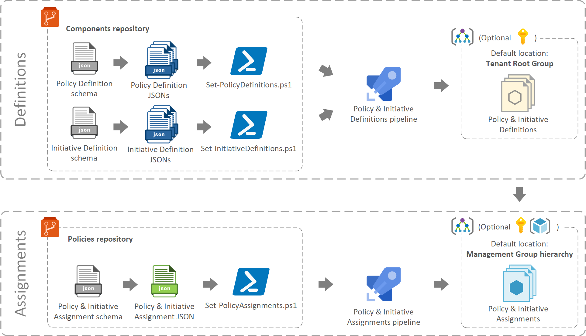

[[_TOC_]]

# Policy as Code Framework

## Overview

In this section, you'll find information about the automated **Azure Policy Framework** (Policy as Code Framework) that handles **built-in** and **custom Policies** and **Initiatives** and their **assignments in Azure**.

The framework's approach is

- **declarative**: the configuration scripts are data-driven (policy definitions and assignments are defined in JSON files), and
- **idempotent**: i.e. not changing any values in the JSON files results no changes in Azure (= the script can be run unlimited number of times, without having any impact).

**[Definitions](./.docs/Definitions.md)**: This framework is able to pick up custom Azure Policy and Initiative definitions from a given folder, and register these as Policy/Initiative definitions in the defined scope of Azure (Management Group or Subscription). If a change is made to a definition, or the JSON file it has been defined in is deleted, the framework adjusts the Policies/Initiatives in Azure accordingly.

**[Assignments](./.docs/Assignments.md)**: Once these custom definitions are available in Azure, the framework can assign these custom definitions or any other built-in definitions to any arbitrarily chosen point in the Azure management hierarchy - i.e. any Management Groups / Subscriptions / Resource Groups. The assignment scope and exceptions are defined in a custom 'Policy & Initiative assignment Schema' JSON file.

## Scenarios

The Policy as Code framework supports the following scenarios:

- Scoping
  - **Centralized approach**: One centralized team manages all policy/initiative assignments in the Azure organization, at all levels (Management Group, Subscription, Resource Group).
  - **Distributed approach**: Multiple teams can also manage policy/initiative assignments in a distributed manner, if there's a parallel set Management Group hierarchies defined. In this case individual teams can have their own top level Management group (and corresponding Management Groups hierarchy with Subscriptions and Resource Groups below), but assignments must not be made on the Tenant Root Group level. 
  - **Mixed approach**: A centralized team manages policy/initiative assignments to a certain level (top-down approach), e.g. on the Tenant Root Group level, and top level Management group, and policy/initiative assignments on lower levels (i.e. lower level Management Groups, Subscriptions and Resource Groups) is managed by multiple teams, in a distributed manner.
- Separation
  - **Administering definitions and assignments separately**: A dedicated team (e.g. security team) is responsible for assigning policies/initiatives in the organization, but another team is responsible for developing and maintaining custom policy/initiative definitions.

> **NOTE**: both the definition and assignment configuration script have been written to be run from a pipeline (unattended mode, executed by an SPN), but they also work when running from a PC (in interactive mode, executed by a user).

## Next steps

Before you proceed with the implementation, read the following documents:

- **[Definitions](./.docs/Definitions.md)**
- **[Assignments](./.docs/Assignments.md)**
- **[Quick Start guide](./.docs/QuickStart.md)**
